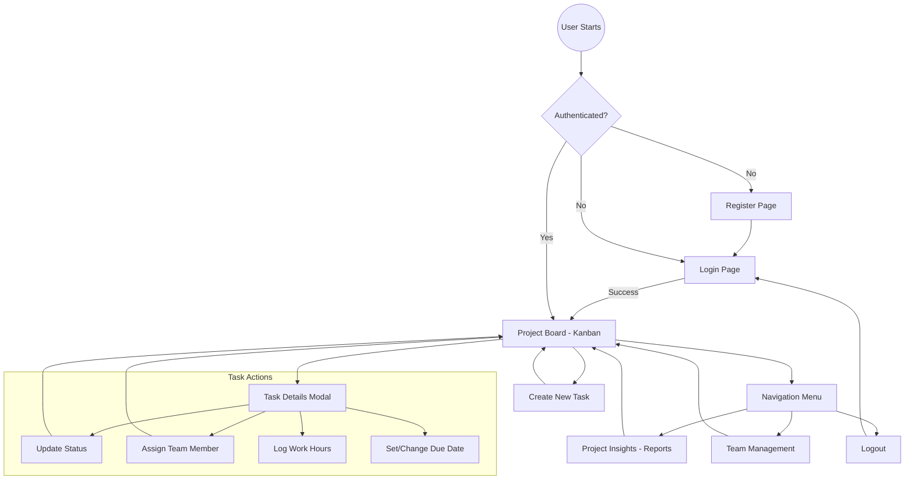
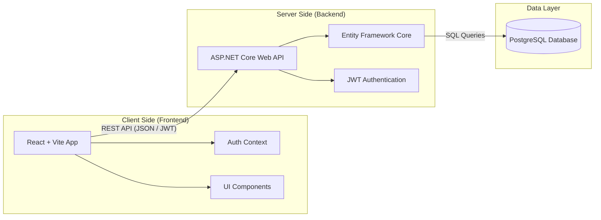

# VibeFlow - Application Flow & Architecture

This document provides a visual overview of how users interact with VibeFlow and how the underlying components communicate.

## User Flow Diagram

The following diagram illustrates the primary user journey from authentication to task management and insights.

## System Architecture

VibeFlow follows a modern client-server architecture with a centralized database.

## Core Workflows

### 1. Task Lifecycle
`Backlog` → `To Do` → `In Progress` → `Review` → `QA` → `Done`

### 2. Time Tracking
`User selects task` → `Enters hours & description` → `API records WorkLog` → `Report aggregate updates`

### 3. Authentication
`Credentials` → `API validates` → `JWT returned` → `Stored in LocalStorage` → `Attached to subsequent headers`
